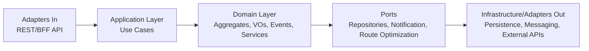

# Architecture

## 1. Bounded Contexts propuestos

- Customer Management
- Product Catalog
- Inventory
- Orders
- Route Planning
- Deliveries
- Fleet Management
- Payments
- Accounts Receivable
- Notifications
- Identity and Access Management
- Audit

## 2. Recomendación arquitectónica

### Opción A: Monolito modular

**Ventajas**
- Menor complejidad operativa para un equipo pequeño.
- Menor costo inicial de infraestructura.
- Mejor velocidad para validar reglas de negocio complejas y transaccionales.
- Observabilidad, seguridad y pruebas más simples en la etapa inicial.

### Opción B: Microservicios

**Ventajas**
- Escalado independiente por dominio.
- Aislamiento de fallos y despliegues por componente.

**Desventajas iniciales**
- Mayor costo operativo.
- Mayor complejidad en consistencia, trazabilidad, seguridad y DevOps.
- Sobrecarga significativa para un equipo reducido.

### Recomendación

Comenzar con **monolito modular DDD** con límites de contexto explícitos, puertos de dominio y eventos internos. Extraer microservicios solo cuando existan cuellos de botella reales de escalado, autonomía de equipos o desacoplamiento operativo.

## 3. Diagramas C4

### System Context

```mermaid
C4Context
    title Smart Logistic - System Context
    Person(customer, "Cliente", "Solicita pedidos, consulta entregas y saldos")
    Person(dispatcher, "Despachador", "Planifica rutas y gestiona reprogramaciones")
    Person(driver, "Conductor", "Ejecuta entregas y registra evidencias")
    Person(collections, "Cobranzas", "Registra pagos y gestiona cuentas por cobrar")
    System(system, "Smart Logistic Platform", "Gestión logística y administrativa")
    System_Ext(notifications, "Canales de notificación", "Email, SMS, WhatsApp, Push")
    System_Ext(identity, "Proveedor de identidad", "OIDC/OAuth2")
    customer --> system
    dispatcher --> system
    driver --> system
    collections --> system
    system --> notifications
    system --> identity
```

### Container

```mermaid
C4Container
    title Smart Logistic - Container Diagram
    Person(dispatcher, "Despachador")
    Person(driver, "Conductor")
    Person(backoffice, "Operación")
    System_Boundary(s1, "Smart Logistic") {
        Container(webapp, "Web App / BFF", "Frontend + BFF", "Portal web responsivo")
        Container(monolith, "Modular Monolith", "Spring Boot", "Dominios, casos de uso, APIs y eventos internos")
        ContainerDb(pg, "PostgreSQL", "RDBMS", "Persistencia transaccional")
        Container(queue, "Outbox / Mensajería futura", "Tabla/broker", "Publicación confiable de eventos")
    }
    System_Ext(idp, "Identity Provider", "OIDC")
    System_Ext(channels, "Notification Providers", "Email/SMS/WhatsApp/Push")
    dispatcher --> webapp
    driver --> webapp
    backoffice --> webapp
    webapp --> monolith
    monolith --> pg
    monolith --> queue
    monolith --> idp
    monolith --> channels
```

### Component



## 4. Estructura propuesta del repositorio

```text
smart-logistic/
├── docs/
│   ├── architecture.md
│   ├── backlog.md
│   ├── domain-glossary.md
│   ├── project-context.md
│   └── decisions/
├── src/
│   ├── main/java/.../{adapters,application,domain,infrastructure}
│   ├── main/resources/{application.yaml,db/migration,openapi}
│   └── test/java/...
├── docker-compose.yml
├── Dockerfile
└── pom.xml
```

## 5. Modelo inicial de dominio

- **Customer**: identidad técnica, RUT, condiciones de pago, prioridad comercial.
- **CustomerAddress**: dirección, comuna, región, coordenadas.
- **Product**: SKU, tipo de bidón, precio, retornabilidad.
- **InventoryItem**: stock disponible, vacíos, dañados, umbral de alerta.
- **Order**: estado, líneas, fechas, trazabilidad, reprogramaciones.
- **RecurrenceRule**: frecuencia, ventanas, suspensión y generación idempotente.
- **Route / RouteStop**: versión de planificación, vehículo, secuencia, capacidad.
- **Delivery / DeliveryAttempt**: intentos, evidencias, retornos, observaciones.
- **Payment / AccountsReceivable**: abonos, saldos, estados y vencimientos.
- **BusinessCalendar**: siguiente día hábil considerando fines de semana y feriados.

## 6. Arquitectura Docker Compose local

- `app`: Spring Boot.
- `postgres`: persistencia principal.
- volumen persistente para PostgreSQL.
- perfil `docker` para conectar la app con PostgreSQL.

## 7. Roadmap

1. Bootstrap arquitectónico y documentación.
2. Vertical slice: clientes, productos, inventario y pedidos.
3. Recurrencias y calendario de negocio chileno.
4. Planificación de rutas y reprogramaciones.
5. Entregas, reintentos y pagos.
6. Seguridad, observabilidad y hardening operativo.
7. Integraciones externas, outbox y evolución a microservicios cuando sea necesario.

## 8. Riesgos principales

1. Complejidad del dominio logístico y administrativo mezclado.
2. Dependencia futura de geocodificación/optimización externa.
3. Reglas locales de feriados, ventanas y cobranza.
4. Duplicados por recurrencias y reintentos sin idempotencia robusta.
5. Crecer a microservicios prematuramente.

## 9. Preguntas críticas

1. ¿El MVP prioriza backoffice web o también portal/autoservicio de clientes?
2. ¿La planificación del día siguiente debe cerrarse a una hora operativa fija?
3. ¿Los pagos se registrarán inicialmente solo de forma manual o ya existe integración objetivo?
4. ¿La empresa opera con una única bodega inicial o varias bodegas/centros de despacho?
5. ¿Se requiere facturación electrónica dentro del MVP o solo dejar puertos preparados?
