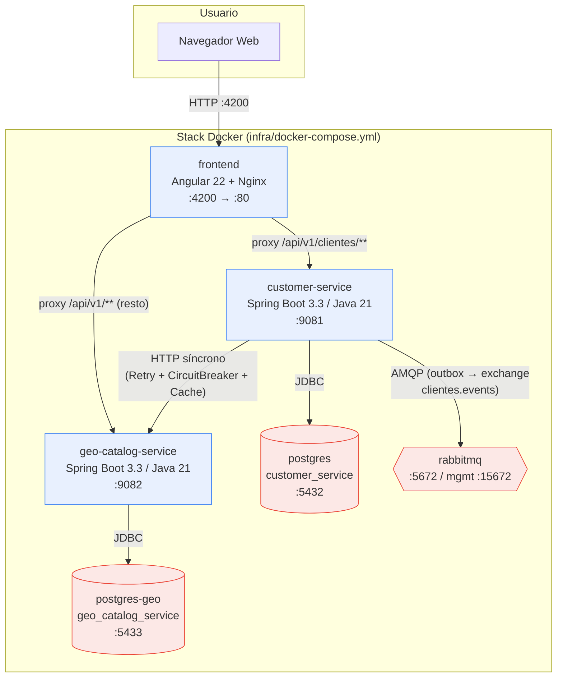
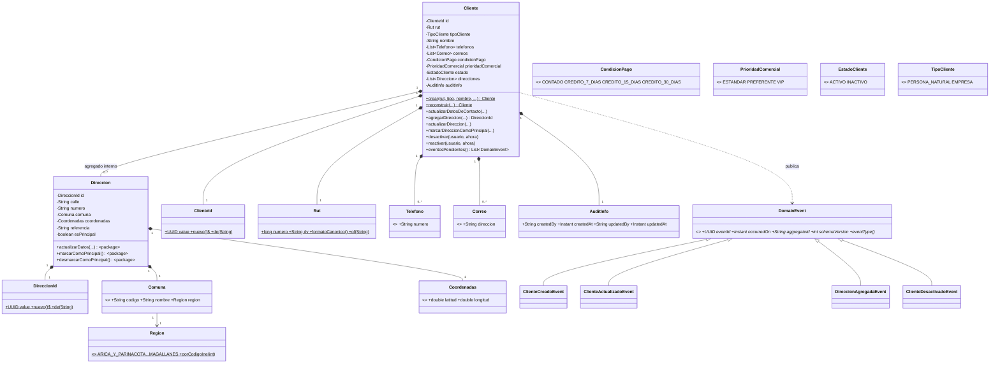
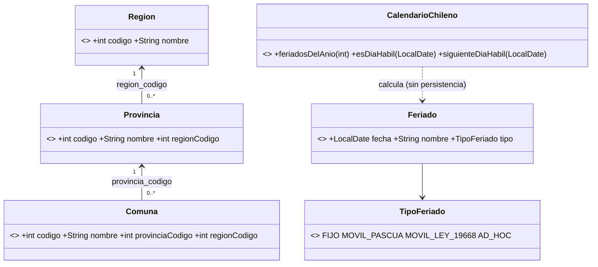
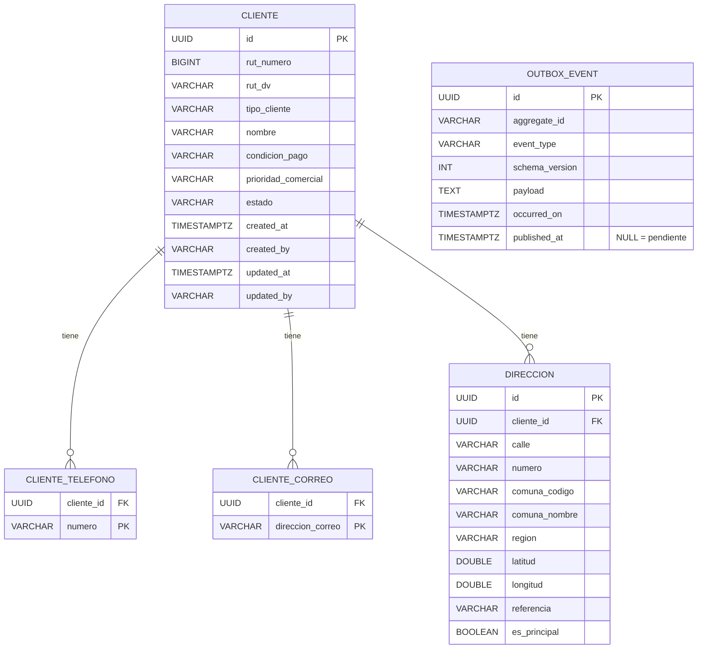
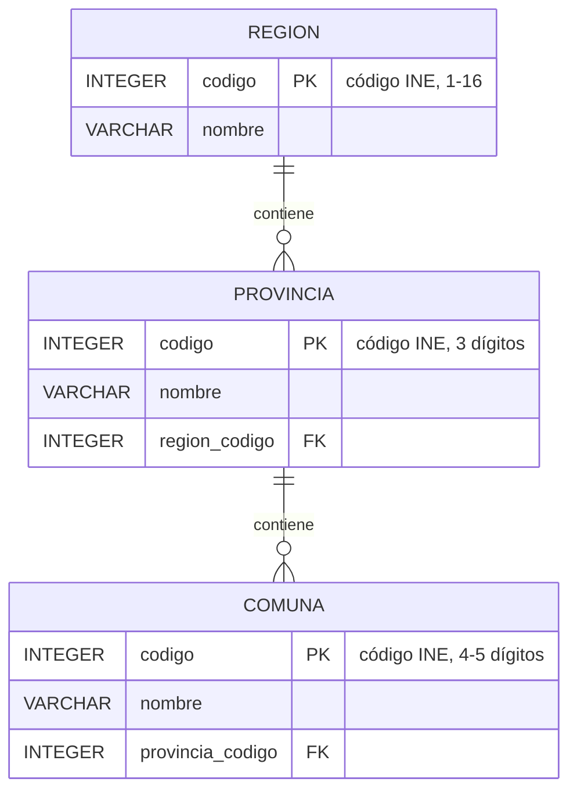
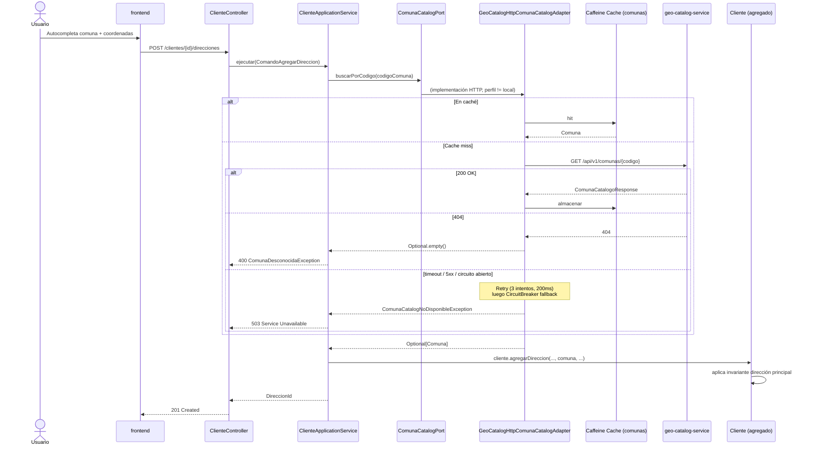
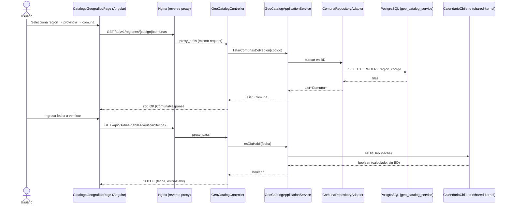
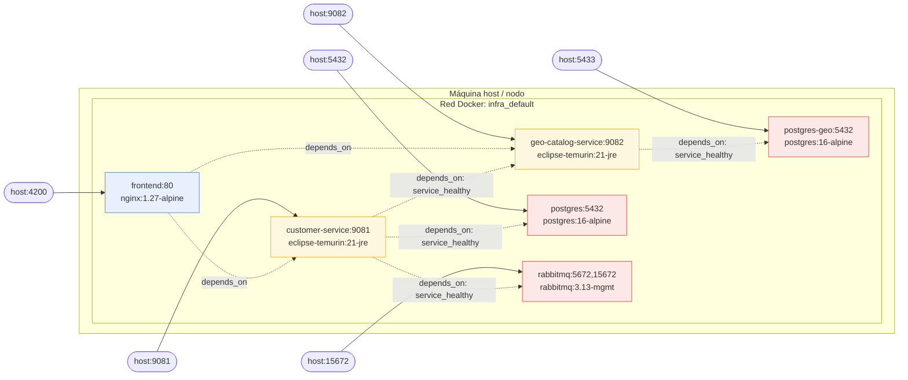

# Documentación de Diseño — Smart Logistic

> Este documento consolida, con diagramas UML (notación Mermaid, renderizable
> directamente en GitHub), la arquitectura, los flujos de ejecución, el modelo de
> datos y la guía de despliegue del sistema **tal como está implementado hoy** en el
> repositorio. Complementa — no reemplaza — los ADRs individuales en
> `docs/architecture/00` a `06`, que documentan el *porqué* de cada decisión; aquí se
> documenta el *qué* y el *cómo*, con foco visual.

---

## 1. Requerimientos tomados y cómo se resuelven

### 1.1 Requerimientos de negocio (funcionales)

| # | Requerimiento | Cómo se resuelve |
|---|---|---|
| R1 | Gestionar clientes (personas naturales y empresas) con RUT único, datos de contacto, condición de pago y prioridad comercial | Agregado `Cliente` en `customer-service`, con invariantes de negocio encapsuladas (ver §3.1) y API REST `/api/v1/clientes` (ADR bounded context Clientes, §3 de `03-...md`) |
| R2 | Cada cliente puede tener múltiples direcciones de entrega, con coordenadas geográficas para planificación de rutas futura | Entidad interna `Direccion` dentro del agregado `Cliente`, con invariante de "exactamente una dirección principal" |
| R3 | Las direcciones deben validarse contra la división político-administrativa oficial de Chile (región/provincia/comuna) | `geo-catalog-service`: catálogo de 16 regiones / 56 provincias / 346 comunas con códigos oficiales INE, consumido por `customer-service` vía HTTP (ADR 05) |
| R4 | Determinar si una fecha es día hábil chileno (fines de semana + feriados legales) para uso futuro en agendamiento de entregas | `CalendarioChileno` en `shared-kernel`: cálculo algorítmico (fijos, Pascua vía Meeus/Jones/Butcher, traslados Ley 19.668), expuesto también como API en `geo-catalog-service` (`/api/v1/dias-habiles/**`, `/api/v1/feriados`) |
| R5 | El RUT nunca debe ser clave técnica interna (regla dura del negocio) | Cada agregado usa `UUID` (`ClienteId`) como PK; `Rut` es un *Value Object* con dígito verificador, único a nivel de negocio (`UNIQUE` en BD) pero nunca FK entre servicios |
| R6 | Un cliente no se elimina físicamente; se conserva su historial comercial | `Cliente.desactivar()` cambia `estado` a `INACTIVO` (soft-delete lógico); no existe operación de borrado físico en el dominio |
| R7 | El sistema debe escalar y desplegarse en apps móviles a futuro, y en una nube aún no definida | API REST versionada (`/api/v1/...`) y stateless en cada servicio; empaquetado 100% en contenedores Docker sin dependencias a servicios propietarios de un proveedor cloud específico |
| R8 | Interfaz web para operar el sistema | `frontend/` (Angular 22, standalone + signals + Angular Material): listado/alta/detalle de clientes, gestión de direcciones, explorador del catálogo geográfico |

### 1.2 Requerimientos no funcionales

| # | Requerimiento | Cómo se resuelve |
|---|---|---|
| NF1 | Escalado independiente por dominio (Clientes cambia poco, otros dominios futuros cambian mucho) | Estilo **microservicios** desde el día 1, uno por *bounded context*, cada uno con su propio ciclo de build/deploy (ADR-001) |
| NF2 | Aislamiento de fallos: una caída de un servicio de referencia no debe tumbar la escritura de datos core | *Circuit breaker* + *retry* + caché Caffeine en la integración `customer-service` → `geo-catalog-service` (ADR 05); un 503 explícito (`ComunaCatalogNoDisponibleException`) en vez de fallo silencioso |
| NF3 | Consistencia entre servicios sin transacciones distribuidas | *Database per Service* + **Transactional Outbox** + RabbitMQ (ADR-002); eventos versionados (`schemaVersion`) e idempotencia vía `eventId` |
| NF4 | Portabilidad (Docker, cualquier nube) | Cada servicio tiene su `Dockerfile` multi-stage; `infra/docker-compose.yml` orquesta el stack completo localmente sin dependencia de un orquestador propietario |
| NF5 | Trazabilidad de procedencia de datos de referencia | Catálogo geográfico documenta explícitamente su fuente (`knxroot/bdcut-cl`) y limita el alcance no cubierto (Ley 20.983) — ver §4 de `04-...md` |
| NF6 | Pipeline de pruebas rápido en el día a día, sin forzar Docker en cada `mvn test` | Pirámide de 4 niveles (unitarias → Testcontainers → smoke Docker Compose → BDD Cucumber), detallada en ADR 06 |
| NF7 | Auditoría de cambios (quién/cuándo) | `AuditInfo` (VO en `shared-kernel`) embebido en cada agregado; header `X-Usuario` / query param `usuario` en las mutaciones REST (placeholder hasta implementar Identidad y Acceso) |

### 1.3 Explícitamente fuera de alcance (declarado, no un olvido)

- Autenticación/autorización real (Spring Security + JWT es un punto de extensión documentado, no implementado).
- Persistencia o versionado histórico del catálogo geográfico (se trata como snapshot vigente).
- Regla de feriado adicional Ley 20.983 (Fiestas Patrias condicional).
- Bounded contexts de Inventario, Pedidos, Recurrencias, Reprogramación, Planificación Logística y Pagos (roadmap iterativo, ver `00-overview.md` §5).

---

## 2. Vista de arquitectura (C4 — Contenedores)



**Notas de la vista:**
- `frontend` nunca llama directo a `customer-service`/`geo-catalog-service` en producción: Nginx actúa como *reverse proxy* (`nginx.conf`), evitando CORS y no exponiendo los backends al navegador (ver §6.2).
- `RabbitMQ` hoy no tiene consumidores propios en el repositorio (no existen aún Pedidos/Inventario); `customer-service` publica a través del *outbox* dejando la integración lista para el próximo bounded context consumidor.
- `geo-catalog-service` no publica eventos (es de solo lectura, ADR bounded context §9).

---

## 3. Diagrama de clases — Dominio

### 3.1 `customer-service` (bounded context Clientes)



**Invariantes clave (impuestas por el propio agregado, no por la capa de persistencia):**
1. `Cliente` requiere al menos un teléfono o correo para poder ser `ACTIVO` (`ClienteSinContactoException`).
2. Existe **exactamente una** `Direccion` marcada `esPrincipal` cuando hay ≥1 dirección; la primera dirección agregada se marca principal automáticamente.
3. `Direccion` solo es mutable a través de métodos *package-private*, invocados exclusivamente desde `Cliente` (encapsulamiento del agregado).
4. Toda mutación relevante encola un `DomainEvent` recuperado por la capa de aplicación (`eventosPendientes()`), nunca publicado directamente por el dominio (el dominio no conoce RabbitMQ).

### 3.2 `geo-catalog-service` (bounded context Catálogo Geográfico)



**Notas:** a diferencia de Clientes, aquí las claves primarias **son** el código oficial INE (excepción documentada y justificada en `04-bounded-context-catalogo-geografico.md §3`, porque el código INE es emitido por una autoridad externa estable, no por este sistema). `CalendarioChileno` no tiene estado ni tabla propia: es una función pura invocada en cada request.

---

## 4. Modelo de datos (diagrama entidad-relación)

### 4.1 Esquema `customer-service` (PostgreSQL, Flyway `V1__init_schema.sql`)



- `uk_cliente_rut UNIQUE(rut_numero, rut_dv)`: garantiza unicidad de negocio del RUT sin usarlo como PK.
- `idx_outbox_event_pendientes` (índice parcial `WHERE published_at IS NULL`): optimiza el *polling* del `OutboxDispatcher`.
- `OUTBOX_EVENT` no tiene FK hacia `CLIENTE`: es una tabla de infraestructura de mensajería, desacoplada intencionalmente del modelo de dominio.

### 4.2 Esquema `geo-catalog-service` (PostgreSQL, Flyway `V1`–`V4`)



- Datos sembrados vía `V2__seed_regiones.sql` / `V3__seed_provincias.sql` / `V4__seed_comunas.sql` (346 comunas), generados desde `docs/data/bdcut-cl-raw.csv` (fuente pública `knxroot/bdcut-cl`).
- Sin tabla de feriados: se calculan en memoria (ver §3.2).
- **Database per Service**: no existe ninguna FK entre el esquema de `customer-service` y el de `geo-catalog-service`; la única integración es HTTP (§5.3).

---

## 5. Diagramas de secuencia (flujos principales)

### 5.1 Crear cliente (con publicación de evento vía Transactional Outbox)

```mermaid
sequenceDiagram
    actor U as Usuario
    participant FE as frontend (Angular)
    participant CTRL as ClienteController
    participant APP as ClienteApplicationService
    participant DOM as Cliente (agregado)
    participant REPO as ClienteRepositoryAdapter
    participant DB as PostgreSQL (customer_service)
    participant OUT as OutboxDispatcher (scheduler)
    participant MQ as RabbitMQ

    U->>FE: Completa formulario "Nuevo cliente"
    FE->>CTRL: POST /api/v1/clientes
    CTRL->>APP: ejecutar(ComandoCrearCliente)
    APP->>APP: valida RUT único (existePorRut)
    APP->>DOM: Cliente.crear(rut, ...)
    DOM->>DOM: valida invariante (>=1 contacto)
    DOM-->>APP: Cliente + evento ClienteCreadoEvent (en memoria)
    APP->>REPO: guardar(cliente)
    REPO->>DB: INSERT cliente + INSERT outbox_event (misma transacción)
    APP->>APP: eventPublisherPort.publicar(eventos)
    Note over APP,DB: publicar() solo persiste en outbox_event;<br/>no hay llamada de red aquí (ADR-002)
    APP-->>CTRL: ClienteId
    CTRL-->>FE: 201 Created {id}
    FE-->>U: Confirmación + navega a detalle

    loop cada 2s (fixedDelay configurable)
        OUT->>DB: SELECT pendientes (published_at IS NULL)
        OUT->>MQ: convertAndSend(clientes.events, "cliente.creado.v1", payload)
        OUT->>DB: UPDATE outbox_event SET published_at = now()
    end
```

**Por qué esta forma:** separar el *commit* transaccional (paso 8) del envío a RabbitMQ (bucle inferior) evita el problema clásico de "dual write" (guardar en BD y publicar en el broker no son atómicos si se hacen directamente). Si el proceso cae entre ambos pasos, el evento queda `published_at = NULL` y se reintenta en el siguiente ciclo — entrega *at-least-once*, por lo que los futuros consumidores deben deduplicar por `eventId`.

### 5.2 Agregar dirección (integración resiliente con Catálogo Geográfico)



**Distinción crítica de esta integración (ADR 05):** un 404 (comuna inexistente) es una respuesta *válida* del dominio → `400 Bad Request`. Una falla de infraestructura (timeout, 5xx, circuito abierto) es un error operacional distinto → `503 Service Unavailable`. El sistema nunca confunde "no existe" con "no disponible".

### 5.3 Consulta de catálogo geográfico y verificación de día hábil (desde el frontend)



---

## 6. Vista de despliegue

### 6.1 Diagrama de despliegue (contenedores, puertos, redes)



### 6.2 Cómo desplegar

#### Opción A — Stack completo con Docker Compose (recomendado, replica producción)

Requisitos: Docker Desktop (o Docker Engine + Compose plugin) en ejecución.

```powershell
cd C:\git\smart-logistic\infra
docker compose up -d --build
```

Esto:
1. Construye las imágenes de `customer-service` y `geo-catalog-service` (multi-stage: Maven+JDK 21 para compilar, JRE 21 liviano para ejecutar, usuario no-root `appuser`).
2. Construye la imagen del `frontend` (multi-stage: Node 22 para compilar Angular en modo `production`, Nginx 1.27 para servir estáticos + *reverse proxy*).
3. Levanta `postgres`, `postgres-geo` y `rabbitmq`, esperando sus *healthchecks* antes de arrancar los servicios de aplicación (`depends_on: condition: service_healthy`).
4. Ejecuta migraciones Flyway automáticamente al iniciar cada servicio Spring Boot.

**Verificación post-despliegue:**
```powershell
docker ps                                    # todos los contenedores "Up"/"healthy"
curl http://localhost:9081/actuator/health   # customer-service → {"status":"UP"}
curl http://localhost:9082/actuator/health   # geo-catalog-service → {"status":"UP"}
curl http://localhost:4200                   # frontend → 200 OK
```

**Puertos configurables** (variables de entorno, valores por defecto entre paréntesis):
`CUSTOMER_SERVICE_PORT` (9081), `GEO_CATALOG_SERVICE_PORT` (9082), `FRONTEND_PORT` (4200),
`CUSTOMER_POSTGRES_PORT` (5432), `GEO_POSTGRES_PORT` (5433), `RABBITMQ_PORT` (5672),
`RABBITMQ_MANAGEMENT_PORT` (15672).

**Importante — un solo consumidor del puerto:** si se usa `ng serve` (modo desarrollo) en paralelo al contenedor `frontend`, ambos compiten por el puerto 4200 y el navegador puede terminar hablando con el proceso equivocado (el dev server llama directo a `localhost:9081/9082`, sin proxy ni CORS). Usar **uno u otro**, no ambos a la vez.

#### Opción B — Desarrollo local ligero (sin Docker para los servicios de aplicación)

Perfil Spring `local`: usa H2 en memoria, deshabilita Flyway y el *outbox*/health-check de RabbitMQ.

```powershell
cd services\customer-service
mvn -DskipTests package
java -jar target\customer-service.jar --spring.profiles.active=local

cd services\geo-catalog-service
mvn -DskipTests package
java -jar target\geo-catalog-service.jar --spring.profiles.active=local

cd frontend
npm install
npx ng serve   # http://localhost:4200, apunta a localhost:9081/9082 (environment.ts)
```

#### Opción C — Desarrollo con infraestructura real (Postgres + RabbitMQ vía Docker, apps en JVM local)

```powershell
docker compose -f infra\docker-compose.yml up -d postgres postgres-geo rabbitmq
cd services\customer-service; mvn -DskipTests package; java -jar target\customer-service.jar
cd services\geo-catalog-service; mvn -DskipTests package; java -jar target\geo-catalog-service.jar
```

#### Despliegue en la nube (orientación general)

El sistema no está acoplado a un proveedor específico (requisito NF4/R7): cada servicio es una imagen Docker autocontenida que expone `/actuator/health` para *liveness/readiness probes*. Para producción se recomienda:
- Orquestador de contenedores (Kubernetes gestionado, Azure Container Apps, ECS, etc.) con un *Deployment* por servicio y *readiness probe* sobre `/actuator/health`.
- PostgreSQL gestionado (una instancia por *bounded context*, preservando *Database per Service*) en lugar de los contenedores `postgres`/`postgres-geo` de desarrollo.
- RabbitMQ gestionado o cluster propio con *dead-letter exchange* configurado (ADR-002).
- Variables de entorno equivalentes a las de `docker-compose.yml` (`SPRING_DATASOURCE_URL`, `GEOCATALOGSERVICE_BASEURL`, credenciales RabbitMQ) inyectadas vía *secrets* del orquestador, no *hardcoded*.
- El *reverse proxy* de `frontend` (Nginx) puede sustituirse por un *API Gateway*/*Ingress* cuando exista más de un canal cliente (ADR-001, "consecuencias").

### 6.3 Estrategia de pruebas antes de desplegar

Ver detalle completo en `06-estrategia-de-pruebas.md`. Resumen ejecutable:

```powershell
mvn test                                             # Nivel 1: unitarias, sin Docker (segundos)
mvn verify                                            # Nivel 2: + integración con Testcontainers (requiere Docker)
.\infra\docker-compose-smoke-test.ps1                 # Nivel 3: smoke E2E sobre imágenes Docker reales
mvn -f qa-automation/pom.xml verify `
  "-Dcustomer.service.base-url=http://localhost:18081" `
  "-Dgeo.catalog.service.base-url=http://localhost:18082"   # Nivel 4: BDD/Cucumber
```

---

## 7. Trazabilidad de este documento

| Fuente | Verificado contra |
|---|---|
| Modelo de dominio (§3) | Código fuente en `services/*/src/main/java/.../domain/model` |
| Modelo de datos (§4) | Migraciones Flyway reales (`V1__init_schema.sql` de ambos servicios) |
| Flujos (§5) | `ClienteApplicationService`, `OutboxDispatcher`, `GeoCatalogHttpComunaCatalogAdapter`, `GeoCatalogController` |
| Despliegue (§6) | `infra/docker-compose.yml`, `Dockerfile` de cada servicio y del frontend, `frontend/nginx.conf` |
| Requerimientos (§1) | `docs/architecture/00-overview.md` y ADRs 01, 02, 05; código de invariantes en `Cliente.java` |

Este documento debe actualizarse en cada nueva iteración del roadmap (`00-overview.md §5`) que agregue un *bounded context* nuevo (Inventario, Pedidos, etc.).
